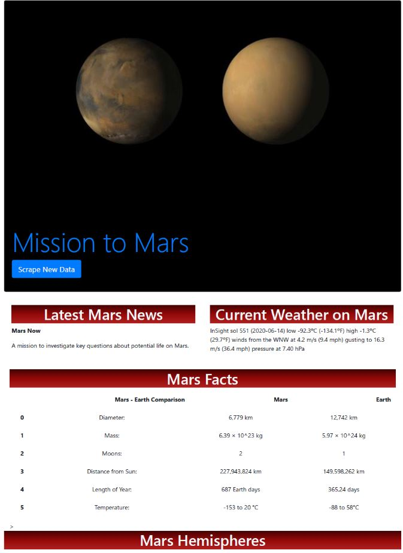
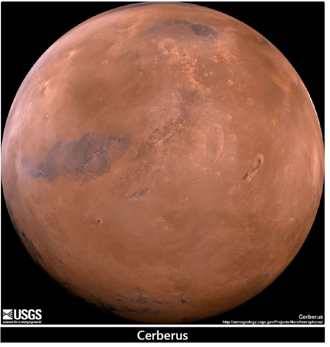
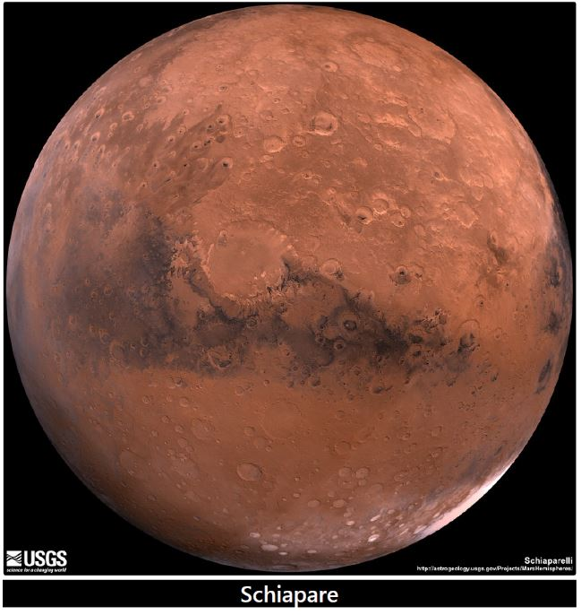
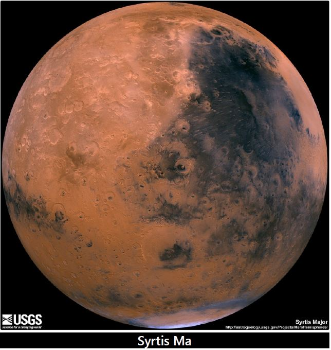
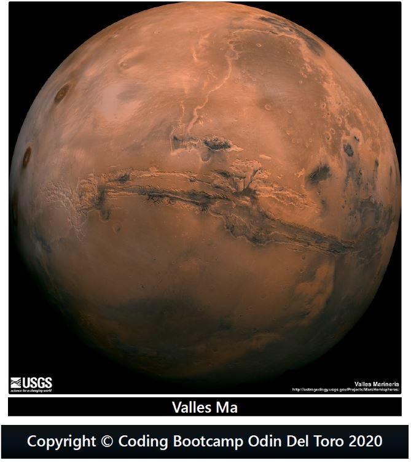

# Mission to Mars
## Objective:
Create a website scraping data, images, and tables from using python, Flask, MongoDb, HTML and CSS. Data consists of NASA's latest news, weather tweets, space facts, hemispheres and images.

## Sources
NASA: [NASA's Mars News Site](https://mars.nasa.gov/news/)

JPL: [JPL space images](https://www.jpl.nasa.gov/spaceimages/?search=&category=Mars)

Twitter: [Mars weather tweets](https://twitter.com/marswxreport?lang=en)

Space facts: [Mars space facts](https://space-facts.com/mars/)

Hemispheres: [Mars Hemispheres](https://astrogeology.usgs.gov/search/results?)

## Website

Website: [Mission to Mars](https://odindeltoro.github.io/Web-Scraping-Challenge/templates)

